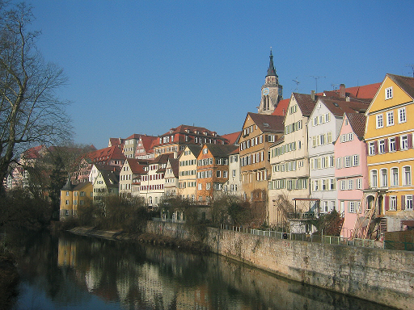

# Style Transfer From Scratch

Style Transfer written from scratch with Pytorch. Based on publication [Image Style Transfer Using Convolutional Neural Networks](https://www.cv-foundation.org/openaccess/content_cvpr_2016/papers/Gatys_Image_Style_Transfer_CVPR_2016_paper.pdf).


## Example usage
```python
from torch import optim, cuda

from style_transfer_from_scratch.model import VGG19FeaturesExtractor
from style_transfer_from_scratch.style_transfer import run_style_transfer
from style_transfer_from_scratch.utils import read_preprocess_image, initialize_image, create_experiment_folder

DEVICE = 'cuda' if cuda.is_available() else 'cpu'

img_content = read_preprocess_image(img_path='path/to/img/content', img_height=400).to(DEVICE)
img_style = read_preprocess_image(img_path='path/to/img/style', img_height=400).to(DEVICE)
create_experiment_folder('experiment name', 'path/to/experiment/folder')

generated_img = initialize_image(method='normal_distr', size=img_content.size(), device=DEVICE)
vgg19_features_extractor = VGG19FeaturesExtractor().to(DEVICE)
optimizer = optim.LBFGS([generated_img], max_iter=1000)

generated_img = run_style_transfer(
    generated_img=generated_img,
    features_extractor=vgg19_features_extractor,
    optimizer=optimizer,
    content_img=img_content,
    style_img=img_style,
    content_weight=1e2, # play with these hyperparameters
    style_weight=1e0,
    total_variation_weight=1e-3,
    experiment_name='experiment name',
    experiments_path='path/to/experiment/folder',
    save_generated_img=True
)
```

## Experiments
### Images from original paper
| | |
| ------------- | ------------- |
|  |  |
|  |  |
|  |  |
### Content / style tradeoff
The generated images were obtained for the style weight values: 0.01, 0.1, 1, 10.
| | |
| ------------- | ------------- |
|  |  |
|  |  |
### Total variational loss weight value analysis
The generated images were obtained for the total variational loss weight values: 0.01, 0.1, 1, 10.
| | |
| ------------- | ------------- |
|  |  |
|  |  |

### Additional info
Contrary to the original method presented in article, I did not use normalized VGG19 model and I used max pooling (not average pooling) in the VGG19 model. I got better results for pixel values ​​in the range [0; 255], even though Pytorch's VGG19 was trained on images with pixel values ​​in the range [0; 1].

### Citations
```
@INPROCEEDINGS{7780634,
    author={Gatys, Leon A. and Ecker, Alexander S. and Bethge, Matthias},
    booktitle={2016 IEEE Conference on Computer Vision and Pattern Recognition (CVPR)}, 
    title={Image Style Transfer Using Convolutional Neural Networks}, 
    year={2016},
    volume={},
    number={},
    pages={2414-2423},
    keywords={Image reconstruction;Neural networks;Image representation;Semantics;Neuroscience;Feature extraction;Visualization},
    doi={10.1109/CVPR.2016.265}
}

```

```
@misc{simonyan2015deep,
    title={Very Deep Convolutional Networks for Large-Scale Image Recognition}, 
    author={Karen Simonyan and Andrew Zisserman},
    year={2015},
    eprint={1409.1556},
    archivePrefix={arXiv},
    primaryClass={cs.CV}
}
```